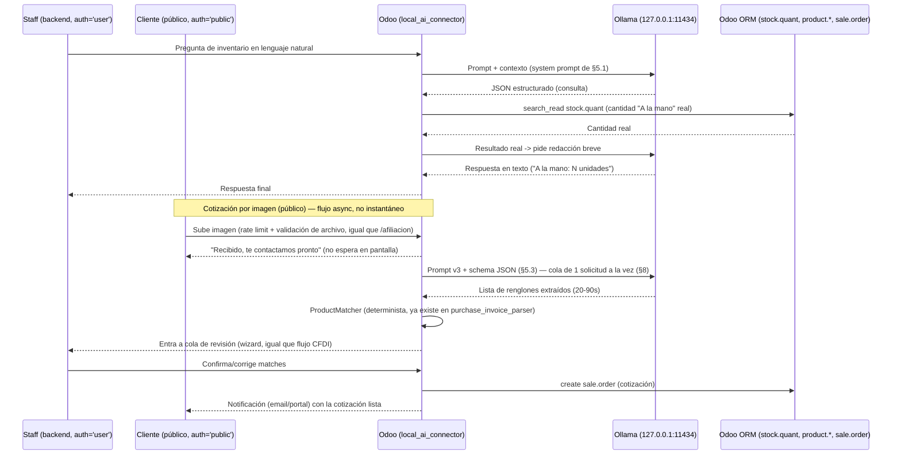

# Configuración del Modelo de IA Local para Odoo 19 — MedicineDepot
# Local AI Model Configuration for Odoo 19 — MedicineDepot

**Fecha / Date:** 2026-07-27
**Autor / Author:** Claude Code (AI Infrastructure Architect / Odoo 19 Lead Developer)
**Basado en / Based on:** auditoría directa del servidor (`nproc`, `free -h`, `lspci`, `ollama list`, `systemctl status ollama`, `ss -tlnp`), del repositorio (`docker-compose.yml`, `docker-compose.test.yml`, `config/odoo*.conf`, `docs/OLLAMA_MIGRATION_PLAN.md`, `custom_addons/purchase_invoice_parser/`), y de las respuestas del usuario sobre casos de uso prioritarios. / direct audit of the server, the repository, and the user's answers on priority use cases — no fabricated data.

---

## 0. Nota metodológica / Methodological Note

Este documento no parte de cero: `docs/OLLAMA_MIGRATION_PLAN.md` ya estableció que Ollama (`qwen2.5-coder:7b`) opera en este servidor desde fuera de Odoo, para dos casos de uso (copiloto ETL y auditoría de compatibilidad de módulos), bajo una regla de gobernanza estricta (todo script generado por IA contra datos reales debe commitearse antes de ejecutarse) y una regla de terminología inquebrantable ('A la mano' / On Hand, nunca "Disponible"/"Stock"/"Existencias"). Este documento **extiende** esa base para cubrir los nuevos casos de uso que el usuario definió hoy: consultas de inventario en lenguaje natural, análisis de reportes financieros/anomalías, y un caso nuevo y más complejo — extracción de productos desde imágenes de cotizaciones escritas a mano.
This document doesn't start from zero: `docs/OLLAMA_MIGRATION_PLAN.md` already established Ollama's two current use cases (ETL copilot, module audit) under a strict governance rule and the unbreakable 'A la mano' (On Hand) terminology rule. This document **extends** that base to cover the new use cases the user defined today.

---

## 1. Resumen Ejecutivo / Executive Summary

| Dimensión | Estado |
|---|---|
| Hardware | 8 CPU (AMD EPYC-Milan, virtualizado), 15 GiB RAM (~9.8 GiB disponibles en promedio), **sin GPU** — inferencia 100% CPU. |
| Ollama | `0.32.4`, `systemd` activo, solo escucha en `127.0.0.1:11434` (sin exposición externa). |
| Modelo instalado | `qwen2.5-coder:7b` (4.7 GB, ~9.7 tok/s en CPU, medido). Texto/código únicamente — **no es multimodal**. |
| Contención del host | `dev` (workers=5, ~2.5GB límite) + `test` (workers=2, ~1.5GB límite) ya comparten el mismo host de 8 CPU/15GB. Ollama es el tercer consumidor. |
| Uso actual | Externo a Odoo: copiloto ETL (scripts xmlrpc.client) + auditoría de compatibilidad de módulos (`.migration-context.json`). |
| Casos de uso nuevos definidos hoy | (1) Consultas de inventario en lenguaje natural ('A la mano'), (2) análisis de reportes financieros/detección de anomalías, (3) extracción de productos desde imágenes de cotizaciones escritas a mano. |
| Brecha detectada | El caso (3) requiere capacidad de **visión**, que el modelo actual no tiene. No hay OCR (`tesseract`) ni librerías de visión (`pytesseract`, `PIL`, `cv2`) instaladas en el servidor. |
| Precedente reutilizable | `custom_addons/purchase_invoice_parser/services/product_matcher.py` ya resuelve "texto extraído → producto real de Odoo" (por barcode/código/nombre) para facturas CFDI. El mismo patrón sirve para (1) y (3). |

---

## 2. Infraestructura Auditada / Audited Infrastructure

### 2.1 Hardware
- CPU: 8 núcleos, AMD EPYC-Milan virtualizado.
- RAM: 15 GiB totales, ~9.8 GiB disponibles en promedio (picos de cgroup de Ollama ya observados hasta 7.9 GB).
- GPU: ninguna. `nvidia-smi` no existe; `lspci` solo muestra un dispositivo de video virtual sin capacidad de cómputo.
- Disco: 438 GB libres de 464 GB — sin restricción para modelos adicionales.

### 2.2 Contención de recursos entre servicios
```
Host: 8 CPU / 15 GiB RAM
├── dev  (8069): workers=5, límite memoria ~2.5GB
├── test (8070): workers=2, límite memoria ~1.5GB
└── Ollama (11434): sin límite de cgroup explícito hoy, picos observados de ~7.9GB
```
**Implicación de diseño:** no hay margen para correr un modelo pesado de forma permanente residente en memoria además de `dev`+`test`. Cualquier modelo nuevo (ej. visión) debe evaluarse primero en modo prueba de concepto, con `OLLAMA_KEEP_ALIVE` bajo (descargar el modelo de RAM entre usos) en vez de mantenerlo cargado 24/7.

### 2.3 Seguridad de red (ya correcto, mantener así)
Ollama solo escucha en `127.0.0.1:11434`. **Ningún endpoint nuevo debe exponer Ollama directamente a internet ni a la red del contenedor de Odoo sin pasar por el proceso de Odoo mismo** — Odoo (backend) debe ser el único cliente de Ollama, nunca el navegador del usuario final.

---

## 3. Modelos Recomendados / Recommended Models

### 3.1 Texto/código (ya instalado, mantener)
`qwen2.5-coder:7b` — sigue siendo correcto para: copiloto ETL, auditoría de módulos, consultas de inventario en lenguaje natural (texto→texto, sin imágenes), y análisis de reportes financieros (el input son tablas/JSON, no imágenes).

### 3.2 Visión (NUEVO — requerido para el caso de "cotización por imagen")
No hay modelo de visión instalado. Opciones evaluadas para hardware **CPU-only, 8 núcleos, RAM compartida**:

| Modelo | Tamaño | Trade-off |
|---|---|---|
| `moondream:1.8b` | ~1.7 GB | **Probado empíricamente (2026-07-27) — falló.** Ver resultado del PoC abajo. Descartado. |
| `qwen2.5vl:7b` | ~6 GB | **Probado empíricamente (2026-07-27) — funcionó, con reservas de latencia y RAM.** Ver resultado del PoC abajo. Candidato viable, pendiente de validar con letra manuscrita real. |
| `llava:7b` | ~4.7 GB | No probado. Alternativa intermedia, comunidad más madura, pero orientado a descripción general de escenas, no especializado en lectura de texto/handwriting. |

**Resultado real del PoC con `moondream:1.8b` (2026-07-27):** se bajó el modelo (1.7GB, ~10s), se generó una imagen sintética con 3 nombres de producto en **texto impreso simple** (no manuscrito — el caso más fácil posible: "PARACETAMOL 500MG C/20 TAB x2", "LOSARTAN 50MG C/30 TABS x1", "IBUPROFENO 400MG C/10 CAP x3"), y se corrió contra el prompt de §5.3 (`format:"json"`, `temperature:0`). **Resultado: falló por completo.** El modelo devolvió `{"texto_detectado": "A la mano", "cantidad_detectada": 0}` — no leyó ningún nombre de producto, y aparentemente alucinó una frase del propio system prompt en vez de transcribir la imagen. Tiempo: 10.29s. Pico de RAM del subproceso de inferencia: ~2.24 GB.

**Resultado real del PoC con `qwen2.5vl:7b` (2026-07-27):** mismo prompt (§5.3), misma imagen sintética, `temperature:0`, `num_ctx:2048`. **Resultado: acertó las 3 líneas de texto impreso correctamente**, incluyendo el encabezado "COTIZACION":
```json
{
  "texto_detectado": "COTIZACION\nPARACETAMOL 500MG C/20 TAB x2\nLOSARTAN 50MG C/30 TABS x1\nIBUPROFENO 400MG C/10 CAP x3",
  "cantidad_detectada": ["x2", "x1", "x3"]
}
```
Dos reservas importantes, no es un "sí" sin matices:
1. **Latencia: 76.45s** para una imagen de 3 líneas cortas (7.6s de carga del modelo + ~69s de evaluación, 85 tokens de salida) — en CPU puro, esto es demasiado lento para un flujo "interactivo" (un usuario esperando en pantalla). Es viable como proceso asíncrono/background (el staff sube la imagen y recibe la propuesta unos minutos después), no como respuesta instantánea.
2. **RAM pico: 6.72 GB** (`VmHWM` del subproceso `llama-server`) — confirmado con `ollama ps` mientras el modelo seguía cargado. Sumado a los límites configurados de `dev` (~2.5GB) y `test` (~1.5GB), el host de 15GB queda **sin margen** si los tres corren a la vez. Esto hace más urgente la pregunta abierta §9.3 (presupuesto de RAM dedicado).
3. **El formato de salida no respetó el schema pedido** (`cantidad_detectada` debía ser una lista de objetos por línea, no un objeto único con un arreglo de strings "x2"/"x1"/"x3") — el prompt de §5.3 necesita ajuste para forzar una lista de objetos `{"texto_detectado", "cantidad_detectada"}` por renglón, no un batch combinado. Detalle de implementación, no invalida el resultado de lectura.

**Conclusión actualizada:** `qwen2.5vl:7b` es el candidato viable para este caso de uso — es el primer modelo que realmente lee el texto de la imagen. Sigue pendiente la prueba con **letra manuscrita real** de clientes (la sintética era texto impreso, el caso fácil) antes de comprometerse en producción, y hay que decidir si el flujo se diseña como asíncrono (dado el tiempo de respuesta) desde el principio.

**Recomendación actualizada:** descartar `moondream:1.8b` para este caso de uso — no superó ni el escenario más fácil (texto impreso). El siguiente paso empírico es repetir la misma prueba con `qwen2.5vl:7b` (más pesado, ~6GB, pero mismo linaje que el modelo de texto que ya funciona bien en este proyecto). Si `qwen2.5vl:7b` tampoco logra leer texto impreso simple, el problema no es de tamaño de modelo sino de que la tarea (vision LLM corriendo en CPU puro) no es viable con el hardware actual, y habría que evaluar un enfoque no-LLM (OCR clásico tipo Tesseract, que no se probó aquí) como paso intermedio antes del matching de productos. Con un solo intento fallido (N=1, texto impreso) no se puede descartar la familia de solución completa — pero sí se puede descartar `moondream:1.8b` específicamente como candidato viable.

---

## 4. Model Tuning — Parámetros por Caso de Uso

| Caso de uso | `num_ctx` | `temperature` | `format` | Justificación |
|---|---|---|---|---|
| ETL / copiloto de scripts (ya en uso) | 4096 | 0.1 | texto (código) | Determinismo alto; ya se detectó que el modelo comete errores de lógica ORM — temperatura baja reduce (no elimina) variabilidad. |
| Auditoría de compatibilidad de módulos (ya en uso) | 4096 | 0.1 | `json` | Igual que hoy — output estructurado y parseable. |
| Consultas de inventario en lenguaje natural ('A la mano') | 2048 | 0.0–0.1 | `json` | Pregunta corta + resultado de una consulta real a Odoo (no el modelo "inventando" cantidades) — el modelo solo traduce lenguaje natural a una consulta estructurada y luego redacta la respuesta con el dato real. Temperatura casi cero: es la peor categoría posible para alucinar (cantidades físicas / dinero). |
| Análisis de reportes financieros / detección de anomalías | 8192 | 0.2 | `json` para hallazgos, texto libre para el resumen | Puede requerir tablas más largas (ej. cientos de líneas de productos, como el caso de las caídas de precio del 27/07). Temperatura ligeramente más alta para permitir redacción de resumen, pero los hallazgos estructurados (qué producto, qué cambio, qué %) deben ir en JSON separado del resumen narrativo, nunca mezclados. |
| Extracción de productos desde imagen (visión) | según modelo (2048–4096) | 0.0 | **JSON Schema real** (objeto, no el string `"json"`) — ver §5.3 v3 | Cero tolerancia a redacción libre: el output debe ser una lista JSON de `{texto_detectado, cantidad_detectada}` cruda, sin que el modelo intente adivinar cuál producto de Odoo es — ese matching lo hace `ProductMatcher` (determinista), no el LLM. **Probado empíricamente:** `format: "json"` genérico no fue suficiente (v2 falló con pérdida silenciosa de datos); `format: <schema>` sí funcionó (v3). |

**Regla transversal:** en ningún prompt de estos el modelo debe **inventar** una cantidad física ('A la mano') o un precio — solo puede (a) traducir lenguaje natural a una consulta estructurada que Odoo ejecuta con datos reales, o (b) redactar/resumir un resultado que Odoo ya calculó. El LLM nunca es la fuente de verdad de un número de inventario o dinero.

---

## 5. System Prompts Base

### 5.1 Prompt — Consultas de inventario en lenguaje natural ('A la mano')
```
Eres un asistente de inventario para MedicineDepot, una farmacia que opera sobre Odoo 19.

REGLA INQUEBRANTABLE: el único término permitido para referirte a la cantidad física
de un producto es "A la mano" (On Hand). Nunca uses "disponible", "stock" o "existencias",
ni en español ni en inglés, bajo ninguna circunstancia.

No conoces cantidades reales. Tu única función es:
1. Traducir la pregunta del usuario a una consulta estructurada en JSON:
   {"producto": "<nombre o código mencionado>", "campo": "a_la_mano"}
2. Cuando el sistema te devuelva el resultado real (consultado en stock.quant),
   redactar una respuesta breve usando exclusivamente el término "A la mano".

Si la pregunta no se refiere a un producto identificable, responde pidiendo aclaración
en vez de adivinar.
```

### 5.2 Prompt — Análisis de reportes financieros / anomalías
```
Eres un analista de datos para MedicineDepot sobre Odoo 19. Recibirás una tabla de
productos con precios anterior y nuevo (list_price y/o standard_price).

Tu tarea es identificar anomalías: cambios porcentuales extremos (ej. caídas o subidas
mayores al 80%) que probablemente sean errores de datos en vez de correcciones legítimas.

Si el análisis involucra cantidades físicas de producto, usa exclusivamente el término
"A la mano" (On Hand) — nunca "disponible", "stock" o "existencias".

Responde en JSON: [{"producto_id": ..., "nombre": ..., "cambio_pct": ..., "riesgo": "alto|medio|bajo"}]
No expliques cada fila en prosa — el resumen narrativo va aparte, en un campo "resumen" al final.
```

### 5.3 Prompt — Extracción de productos desde imagen de cotización

**Historial de versiones (las 3 probadas empíricamente contra `qwen2.5vl:7b`, misma imagen sintética):**

- **v1** (usaba `format: "json"` genérico): el modelo devolvió un objeto único con las cantidades agrupadas en un arreglo aparte en vez de un objeto por línea.
- **v2** (2026-07-27, seguía usando `format: "json"` genérico, solo cambió el texto del prompt para pedir explícitamente "un objeto por renglón" con ejemplo incluido): **probada y falló de forma más peligrosa que v1.** El modelo devolvió un único objeto JSON con la clave `texto_detectado` **repetida 3 veces** (una por renglón). `json.loads()` en Python no lanza error con claves duplicadas — silenciosamente se queda solo con el último valor, **descartando 2 de las 3 líneas sin ningún aviso**. Conclusión: pedir el schema en el texto del prompt, sin importar qué tan explícito, no es confiable con este modelo — hace falta forzar el schema a nivel de la API, no solo describirlo en prosa.
- **v3 (2026-07-27) — funcionó.** Cambio clave: usar el parámetro `format` de la API de Ollama con un **JSON Schema real** (structured output/grammar-constrained decoding), no el string genérico `"json"`, combinado con un ejemplo few-shot en el prompt (el schema por sí solo, sin ejemplo, devolvió un array vacío `[]` válido pero vacío — cumple el schema pero no intenta extraer nada). Con ambos juntos: 3/3 líneas correctas, cantidades bien separadas del texto del producto, en 20.17s (más rápido que v1/v2, probablemente por la eficiencia del grammar-constrained decoding). Único detalle menor: no detectó "x1" como `cantidad_detectada: 1` en un renglón (lo dejó `null`) — imprecisión de lectura, no una falla de formato/schema.

**Prompt v3 (texto):**
```
Vas a recibir una imagen con una lista de productos escrita o impresa por un cliente
de una farmacia, para generar una cotización.

Transcribe CADA renglón de texto que veas en la imagen como un elemento separado de la
lista. Si un renglón incluye una cantidad (ej. "x2", "x1"), separa el texto del producto
de la cantidad numérica.

Ejemplo: si la imagen dice "PARACETAMOL 500MG C/20 TAB x2" y "LOSARTAN 50MG C/30 TABS",
la respuesta debe tener 2 elementos:
- texto_detectado: "PARACETAMOL 500MG C/20 TAB", cantidad_detectada: 2
- texto_detectado: "LOSARTAN 50MG C/30 TABS", cantidad_detectada: null

No devuelvas una lista vacía si hay texto legible en la imagen. No adivines el producto
exacto del catálogo, solo transcribe.

Si algún renglón menciona una cantidad física de inventario existente (poco común en
este flujo), refiérete a ella únicamente como "A la mano" (On Hand). Nunca uses
"disponible", "stock" ni "existencias".
```

**Schema JSON (parámetro `format` de la API, NO el string `"json"`):**
```json
{
  "type": "array",
  "minItems": 1,
  "items": {
    "type": "object",
    "properties": {
      "texto_detectado": {"type": "string"},
      "cantidad_detectada": {"type": ["integer", "null"]}
    },
    "required": ["texto_detectado", "cantidad_detectada"]
  }
}
```

**Lección general para §4/§5 de este documento:** cualquier caso de uso que necesite output estructurado confiable (no solo este) debería usar `format: <json_schema>` en vez de `format: "json"` — la diferencia entre v2 y v3 lo demuestra empíricamente, no es una preferencia teórica. **Regla de ingeniería derivada de este hallazgo:** nunca confiar en que `json.loads()` no lance excepción como señal de éxito — hay que validar además que el resultado sea del tipo esperado (`isinstance(parsed, list)`) y de longitud plausible antes de usarlo; si no, tratarlo como fallo de extracción y enviar a revisión humana, no como dato válido.

**Sigue pendiente:** validar v3 con letra manuscrita real (esta prueba fue con texto impreso sintético, el caso fácil) — sigue siendo la única prueba que responde de verdad la pregunta abierta §9.2.

### 5.4 Prompts ya formalizados en `docs/OLLAMA_MIGRATION_PLAN.md` §4/§11 (sin cambios)
- Generación de scripts ETL (`xmlrpc.client`) — reutilizar tal cual, ya incluye la regla 'A la mano'.
- Auditoría de compatibilidad de módulos (`audit_phase_1`) — reutilizar tal cual.

---

## 6. Integration Flow / Arquitectura de Integración

### 6.1 Decisión: arquitectura híbrida, no todo-o-nada

| Caso de uso | Mecanismo | Por qué |
|---|---|---|
| ETL / auditoría de módulos | Scripts externos `xmlrpc.client` (ya en uso) | Son operaciones batch, offline, con revisión humana obligatoria antes de commitear/ejecutar — no necesitan estar "en vivo" dentro de Odoo. |
| Consultas de inventario en lenguaje natural | **Módulo nuevo `local_ai_connector`**, endpoint interno | Necesita ser interactivo (usuario pregunta, espera respuesta en segundos) — no tiene sentido como script externo. |
| Análisis de reportes financieros | `local_ai_connector`, invocado desde un botón/wizard en el backend, o cron programado para reportes periódicos | Puede ser interactivo (bajo demanda) o programado (ej. reporte semanal de anomalías). |
| Extracción de cotización por imagen | `local_ai_connector` + reutilización de `ProductMatcher` (de `purchase_invoice_parser`) + wizard de revisión humana | Mismo patrón ya probado en producción para CFDI: extracción automática → matching determinista → revisión humana → creación del documento final (`sale.order` en este caso). |

### 6.2 Por qué un módulo Odoo y no exponer Ollama directamente
- Ollama ya está correctamente aislado en `127.0.0.1:11434` — debe seguir así. El navegador del cliente/usuario **nunca** debe hablarle a Ollama directamente.
- El repo ya tiene una convención establecida de controladores (`type='jsonrpc'`/`type='json'`, `auth='public'` o `auth='user'` según el caso) en `custom_shop_qty_selector`, `md_cart_barcode_scanner`, `medicine_depot_website` — `local_ai_connector` sigue el mismo patrón, no inventa uno nuevo.
- Regla de seguridad ya escrita en el repo (`medicine_depot_portal`): nunca `csrf=False` salvo webhooks externos, siempre con autenticación de origen. Con la decisión ya tomada (§9.1), los endpoints de `local_ai_connector` tienen DOS niveles de acceso distintos, no uno solo:
  - **Consultas de inventario NL y análisis de reportes**: `auth='user'` (staff autenticado) — sin cambios, uso interno.
  - **Cotización por imagen**: `auth='public'` (decisión del usuario, 2026-07-27) — requiere el mismo tratamiento que `/afiliacion`/`/web/afiliacion/submit`: rate limiting DB-backed, validación de tamaño/mimetype de archivo, MÁS un límite de concurrencia de inferencia (§8) porque el costo por solicitud es mucho más alto que un formulario normal. No usar `csrf=False` salvo que el flujo real sea multipart sin sesión (igual que `/web/afiliacion/submit`) — justificarlo explícitamente si aplica, no copiarlo por costumbre.

### 6.3 Diagrama de flujo / Flow diagram

**Nota sobre la corrección de §9.1:** con el endpoint de cotización por imagen ya definido como público, el "usuario" deja de ser una sola persona en los dos flujos. Un **cliente público anónimo** nunca debe ser quien "confirma" un match de producto sugerido por el modelo — ese paso de revisión humana lo sigue haciendo **staff interno**, igual que ya funciona en `purchase_invoice_parser` con las facturas CFDI. El cliente solo sube la imagen y (más tarde, async) recibe el resultado ya revisado.



---

## 7. Estructura Propuesta del Módulo `local_ai_connector`

```
custom_addons/local_ai_connector/
├── __manifest__.py                 # depends: base, stock, sale, mail, purchase_invoice_parser (reutiliza ProductMatcher)
├── controllers/
│   └── ai_api.py                   # /ai/inventory_query (auth='user'), /ai/quote_from_image (auth='public', §9.1)
├── services/
│   ├── ollama_client.py            # wrapper HTTP a 127.0.0.1:11434, timeouts, manejo de errores,
│   │                                #   cola de 1 solicitud concurrente (§8), format=JSON Schema no "json" (§5.3 v3)
│   ├── prompt_templates.py         # las plantillas de §5 (v3 para imagen) como constantes versionadas
│   ├── inventory_nl_resolver.py    # traduce el JSON del modelo -> domain de stock.quant real
│   └── image_quote_rate_limit.py   # DB-backed, mismo patrón que affiliation_rate_limit.py de
│                                    #   medicine_depot_portal -- NO reinventar, reutilizar/heredar ese modelo
├── models/
│   ├── ai_query_log.py             # auditoría: qué se preguntó, qué prompt/versión, qué respondió Odoo
│   └── image_quote_request.py      # cola de cotizaciones por imagen: pendiente -> en revisión -> confirmada,
│                                    #   con el cliente/email de origen para la notificación final
├── wizards/
│   └── image_quote_review_wizard.py   # revisión de STAFF (nunca del cliente público), mismo patrón que
│                                        #   purchase_invoice_import_wizard
├── security/
│   └── ir.model.access.csv         # image_quote_request: sin acceso público de lectura/escritura directo,
│                                    #   solo vía el controller (sudo() acotado, como affiliation_rate_limit)
└── tests/
    └── test_inventory_nl_resolver.py   # sin llamar a Ollama real en CI -- mockear la respuesta del modelo
```

**Nota de gobernanza:** igual que con los scripts ETL, cada versión de `prompt_templates.py` debe commitearse antes de usarse contra datos reales, y `ai_query_log` deja rastro de cada interacción — mismo principio de auditabilidad que ya rige el resto del proyecto (evitar el problema de los 33,725 registros `POS-*` sin script versionado). El rate limiter del endpoint público **no se reescribe desde cero**: `medicine_depot_portal` ya tiene uno DB-backed funcionando y verificado bajo `workers=5` (`medicine.depot.affiliation.attempt`, corregido el 2026-07-27 tras comprobar que la versión en memoria no servía) — este módulo debe seguir ese mismo patrón, con un límite más estricto dado el costo de cómputo por solicitud (§9.1).

### 7.1 Primer corte implementado y probado en vivo (2026-07-27)

Se construyó y validó end-to-end la parte de **consultas de inventario en lenguaje natural** (`/ai/inventory_query`, `auth='user'`), con 5 tests unitarios (Ollama mockeado) más pruebas reales contra `dev` con productos de la base real. Análisis de reportes financieros y cotización por imagen **siguen sin implementar** — solo diseño, quedan para una siguiente iteración.

**Hallazgo de infraestructura no anticipado en el diseño original:** Ollama corre en el **host**, pero `local_ai_connector` corre **dentro del contenedor** de Odoo — `127.0.0.1` desde el contenedor es el propio contenedor, no el host. Esto obligó a dos cambios reales de infraestructura, no solo de código:

1. `docker-compose.yml`: se agregó `extra_hosts: ["host.docker.internal:host-gateway"]` al servicio `odoo`, y `ollama_client.py` usa `http://host.docker.internal:11434` en vez de `127.0.0.1`.
2. **Ollama tuvo que dejar de escuchar solo en `127.0.0.1`** (override systemd `OLLAMA_HOST=0.0.0.0:11434`) para ser alcanzable desde el contenedor. Esto por si solo habría expuesto el puerto a **todo internet**, porque se verificó que `ufw` está **inactivo** en este servidor (sin firewall de host). Se cerró con reglas `iptables` explícitas (persistidas con `netfilter-persistent`) que solo permiten `127.0.0.1` y la subred privada de Docker (`172.16.0.0/12`) al puerto 11434, y descartan cualquier otro origen. Verificado: el contenedor conecta correctamente; la regla de bloqueo está activa (no se pudo probar literalmente desde una fuente externa por falta de una segunda máquina, pero la lógica de iptables — primer match gana, ACCEPT explícito antes del DROP general — es estándar y se revisó dos veces tras un primer intento con el orden invertido).

**Limitación real encontrada (no arreglada aún):** la búsqueda de productos por nombre usa `ilike`, que en esta base **no ignora acentos** (extensión `unaccent` de Postgres no instalada, `unaccent=True` no configurado en `odoo.conf`). Una pregunta por "album" no encuentra "ÁLBUM..." aunque el resto de la lógica funcione bien. Confirmado con prueba real. Es una limitación general de este Odoo (no solo de este módulo) — arreglarla requeriría instalar la extensión y habilitar la config, fuera del alcance de esta iteración.

**Lección de prompting repetida una vez más:** la primera versión del prompt (v1) dejaba que el modelo parafraseara el identificador del producto en vez de devolver solo el fragmento exacto (ej. devolvió "Producto con código de barras 8051708031164" en vez de "8051708031164"). Se corrigió en v2 agregando ejemplos concretos de input→output — mismo patrón que ya se vio en §5.3 con el prompt de extracción de imagen: instrucciones en prosa, sin ejemplo, no son suficientes.

### 7.2 Cotización por imagen — implementada y probada end-to-end (2026-07-28)

A diferencia de §7.1 (solo la parte de inventario NL), esta vez se construyó el flujo completo: endpoint público → cola async → cron con IA real → matching de producto → revisión de staff → `sale.order` real. Validado con una foto real de WhatsApp (la misma usada en el PoC de §3.2/§9.2): 71 renglones extraídos, matching corrido contra el catálogo real, un renglón confirmado manualmente por staff (PARACETAMOL - PERRIGO), cotización `S01811` creada correctamente y trazable de vuelta a la solicitud original (`AIQ-00001`).

**Modelos:** `local.ai.image.quote.request` (cabecera + estado: pending → processing → ready_for_review → reviewed/error), `local.ai.image.quote.image` (una o más fotos por solicitud — confirmado necesario en §9.2), `local.ai.image.quote.line` (renglón extraído + producto sugerido, nunca se incluye en la cotización sin `confirmed=True` puesto por un humano). `local.ai.image.quote.attempt` para el rate limit (3 solicitudes/hora por IP — más estricto que `/afiliacion` por el costo real de cómputo).

**Decisión de arquitectura — no se reutilizó `ProductMatcher` de `purchase_invoice_parser` como proponía el diseño original:** ese matcher filtra por `purchase_ok=True` (contexto de compra a proveedores). Aquí el contexto es venta a cliente final — se necesita `sale_ok=True`. Reutilizar la clase de compras habría introducido un bug sutil (productos vendibles pero no comprables invisibles, o viceversa). Se escribió `services/image_quote_matcher.py`, mismo criterio de matching (barcode/código exacto, nombre `ilike` como fallback) pero con el filtro correcto.

**Decisión de arquitectura — sin `queue_job` (OCA) ni lock distribuido propio:** el procesamiento corre vía `ir.cron` (cada 2 minutos, procesa 1 solicitud pendiente por ejecución). La serialización real (nunca 2 imágenes a la vez, crítico dado el pico de 6.7GB por solicitud) no depende de ningún lock nuevo — depende del locking propio de `ir.cron` de Odoo, que ya garantiza que una misma entrada de cron no corre 2 veces en paralelo. El `threading.Lock()` de `ollama_client.py` (§8) sigue sin ser cross-worker, pero eso ya no es crítico para el caso de visión porque el cron lo evita por otro camino — sigue siendo una limitación real para las consultas de texto de §7.1, sin resolver.

**Bugs reales encontrados y corregidos durante la prueba (no solo teoría):**
1. `num_ctx=2048` (default de `generate_structured`) se quedó corto para imágenes reales — mismo problema ya diagnosticado en §9.2, pero se me olvidó pasar el valor correcto en el código nuevo. Corregido a `num_ctx=4096` en `image_quote_processor.py`.
2. `tax_id` no existe en `sale.order.line` en este build de Odoo 19 — el campo correcto es `tax_ids` (plural). Error real de `ValueError` al crear la cotización, encontrado solo al probar en vivo, no en revisión de código.

**Lo que falta — deliberadamente fuera de esta iteración:**
- **Página pública de subida en el sitio web.** El endpoint `/ai/quote_from_image` existe y funciona (probado con `curl -F`), pero no hay ningún formulario HTML en `medicine_depot_website` desde donde un cliente real lo use todavía.
- **Notificación al cliente.** Cuando se crea la cotización, no se le avisa nada al cliente por correo — solo queda registrada internamente. `action_create_quotation` ya postea un mensaje en el chatter del `sale.order`, pero eso es interno, no llega al cliente.
- **`unaccent`** (mismo pendiente de §7.1) también afecta el matching por nombre aquí.

---

## 8. Gobernanza de Recursos / Resource Governance

- **No cargar el modelo de visión de forma permanente.** ~~Usar `OLLAMA_KEEP_ALIVE=60s`~~ **Ya configurado y verificado (2026-07-27)** — override systemd en `/etc/systemd/system/ollama.service.d/override.conf` (`OLLAMA_HOST=0.0.0.0:11434` + `OLLAMA_KEEP_ALIVE=60s`, este archivo vive en el servidor, no en el repo). Confirmado con `ollama ps`: el modelo se descarga de RAM ~60s después de la última consulta.
- **Cola de una sola solicitud a la vez.** Con CPU compartido, procesar solicitudes de IA en serie (un lock simple en `ollama_client.py`) para no degradar la respuesta de `dev`/`test` durante un pico de uso. **Implementado** en `services/ollama_client.py` (`threading.Lock`).
- **Ningún caso de uso nuevo debe correr en el mismo momento que una migración de módulo o un test suite completo** — coordinar manualmente hasta que haya métricas reales de contención.
- **Ollama ya no escucha solo en `127.0.0.1`** (necesario para que el contenedor de Odoo lo alcance, ver §7.1) — se abrió a `0.0.0.0:11434` y se cerró con reglas `iptables` explícitas (solo `127.0.0.1` + subred privada de Docker `172.16.0.0/12`), persistidas con `netfilter-persistent`. **Pendiente de que el usuario confirme en el panel de IONOS** que el firewall a nivel de proveedor tampoco expone ese puerto (fuera del alcance de este documento — requiere acceso a la cuenta del proveedor).

---

## 9. Preguntas Abiertas / Open Questions

1. ~~¿El flujo de cotización por imagen es solo para staff interno, o también para clientes finales vía portal público?~~ **RESUELTO por el usuario (2026-07-27): público.** Razonamiento del usuario: la demanda esperada es baja, tomando en cuenta el volumen promedio de pedidos diarios que ya recibe el sitio — no se espera un pico masivo de solicitudes. Requisito explícito: debe validar cualquier tipo de letra (no solo texto impreso).
   - **Implicación de diseño (derivada, no una nueva pregunta abierta):** "público" con este modelo específico es más caro que un formulario normal — cada solicitud amarra ~20-90s de CPU y hasta 6.72GB de RAM (medido en §3.2/§5.3), en un servidor que ya comparte `dev`+`test`. El endpoint **debe** llevar las mismas protecciones que ya se aplicaron a `/afiliacion` (`medicine_depot_portal/controllers/portal.py`): rate limiting **DB-backed** (no en memoria — ya se comprobó en este mismo proyecto que un limitador en memoria no sirve con `workers=5`, ver §10 de `docs/OLLAMA_MIGRATION_PLAN.md`), más validación de archivo (tamaño/mimetype, mismo patrón que `/web/afiliacion/submit`: límite de tamaño, whitelist JPEG/PNG). Pero además necesita algo que `/afiliacion` no necesitaba: un **límite de concurrencia de inferencia** (máx. 1 imagen procesándose a la vez, ver §8) y un rate limit más estricto que 5/15min (ej. 3 solicitudes/hora por IP), porque el costo por solicitud es mucho mayor que guardar un registro en Postgres — un atacante no necesita muchas solicitudes para saturar la CPU del servidor durante minutos.
   - **Contexto factual ya recolectado (2026-07-27):** el repo ya tiene precedente de endpoints públicos con adjuntos sin login y protecciones concretas: `/web/afiliacion/submit` y `/web/medicd/submit` (`medicine_depot_website/controllers/api.py`, límite 6MB/archivo, whitelist de mimetypes PDF/JPEG/PNG, `csrf=False` justificado), y `/afiliacion` (rate limiting real vía modelo Postgres, patrón a reutilizar tal cual). No hay integración de WhatsApp API — solo enlaces "click-to-chat" (`wa.me/...`).
2. **Precisión real de OCR de escritura a mano en productos farmacéuticos — CERRADA con datos reales (2026-07-27).** Resumen de las 2 fases de PoC:

   **Fase 1 — texto impreso sintético** (ver detalle en §5.3): `moondream:1.8b` falló por completo (descartado). `qwen2.5vl:7b` con prompt/schema v3 (JSON Schema real de la API de Ollama + ejemplo few-shot) funcionó perfecto: 3/3 líneas, 20.17s.

   **Fase 2 — 3 fotos reales de WhatsApp del negocio** (`scripts/test_vision_extraction.py`, imágenes redimensionadas a 1024px de lado mayor porque sin redimensionar la inferencia se volvía impracticable — una corrida se canceló pasados 10+ minutos):
   - **Imagen 1** (818x1640 original): 69 renglones extraídos en 241.7s (~4 min).
   - **Imagen 2** (738x1600 original): 70 renglones extraídos en 227.8s (~4 min). Misma longitud, mismo orden aproximado y varios nombres coincidentes con la imagen 1 (ej. "Omeprazol 20mg x14 tabs" y "Rubin pediatrico jbe." en posiciones casi idénticas) — **son casi con certeza 2 fotos de la MISMA lista física.**
   - **Imagen 3** (899x1599 original): 16 renglones, todos numéricos puros ("10", "2", "12", "25"...) — parece una foto separada, solo de una columna de cantidades, **sin correspondencia 1 a 1 evidente** con las 69-70 líneas de producto de las otras dos fotos.

   **Hallazgos concretos, no teóricos:**
   - **La separación texto/cantidad que funcionó en la prueba sintética (§5.3 v3) falló en el 100% de los renglones reales** — en las 139 líneas combinadas de las imágenes 1 y 2, `cantidad_detectada` salió "sin detectar" en todas; las cantidades (ej. "x2", "x3") se quedaron pegadas dentro de `texto_detectado` en vez de separarse. El prompt v3 no generaliza de texto impreso limpio a fotos reales.
   - **Comparando las imágenes 1 y 2 (la misma lista, 2 fotos) se ve inconsistencia real de lectura**, no solo imprecisión: la misma palabra manuscrita se leyó distinto entre una foto y la otra — ej. "Nivoblok tabs." / "Nivoblok susl." / "Nivoblock tabs." en la imagen 1 vs. "Nivagel tabs" en la imagen 2 (misma posición aproximada en la lista); "Afinano Arzurs Tabs" vs. "Ateleno Arany tabs". Esto es evidencia directa (no inferida) de que el modelo **adivina** en la letra ambigua en vez de leerla con confianza — el mismo trazo produjo dos transcripciones distintas.
   - **Clientes reales pueden mandar la información fragmentada en varias fotos** (productos en una foto, cantidades en otra, sin relación 1:1 evidente) — el diseño de `local_ai_connector` (§7) necesita soportar **múltiples imágenes por solicitud**, no una sola, y muy probablemente necesita que el staff reconcilie manualmente cuál cantidad corresponde a cuál producto cuando vienen separados.
   - **Latencia real: 93-242s por imagen**, incluso ya redimensionada — muy por encima de los 20s de la prueba sintética limpia. Confirma que el flujo **debe ser asíncrono**, ya decidido en §6.3 — aquí queda con evidencia dura, no solo precaución teórica.

   **Conclusión honesta:** `qwen2.5vl:7b` puede usarse como **borrador asistido**, nunca como automatización de confianza. Cada una de las ~139 líneas extraídas necesitaría revisión de staff contra el catálogo real vía `ProductMatcher` antes de convertirse en una cotización — y dado el nivel de ruido observado, hay que esperar una tasa alta de no-match o match ambiguo, no un caso feliz mayoritario. El valor real no es "la IA hace la captura", es "la IA reduce el trabajo de transcripción manual inicial" — la revisión humana total sigue siendo obligatoria, consistente con la gobernanza que ya rige el resto de este proyecto.

   **Decisión final de modelo (2026-07-27, usuario):** quedarse con `qwen2.5vl:7b` local. Se descartan explícitamente: (a) modelos de visión locales más grandes (14B/32B) — en CPU sin GPU serían más lentos que los 93-242s ya observados, no una mejora práctica; (b) Tesseract u OCR clásico — típicamente peor que un modelo de visión moderno en escritura a mano real; (c) servicios de OCR en la nube especializados en handwriting (Google Cloud Vision, Azure AI Vision, AWS Textract) — darían mejor precisión, pero rompen la premisa de "IA local" del proyecto y implican mandar datos de clientes a un tercero; no se descarta para siempre, pero requeriría una decisión de negocio explícita aparte, no una sustitución técnica de rutina.
3. ~~Presupuesto de RAM/CPU dedicado para IA~~ **RESUELTO por el usuario (2026-07-27): sin presupuesto dedicado, aceptar el límite actual.** Con la cola de 1 solicitud concurrente ya implementada (`ollama_client.py`, `threading.Lock`) y `OLLAMA_KEEP_ALIVE=60s` ya configurado y verificado (§8), el peor caso medido es `dev` (~2.5GB) + `test` (~1.5GB) + una imagen procesándose (6.72GB) = **10.72GB de 15GB totales** — ajustado pero sobrevivible, sin contar Postgres. El usuario aceptó explícitamente esta limitación como punto de partida (no reservar RAM/CPU dedicado ni presupuestar un servidor separado por ahora). Si el uso real crece y esto deja de alcanzar, revisar de nuevo — no es una decisión permanente, solo el punto de partida.
