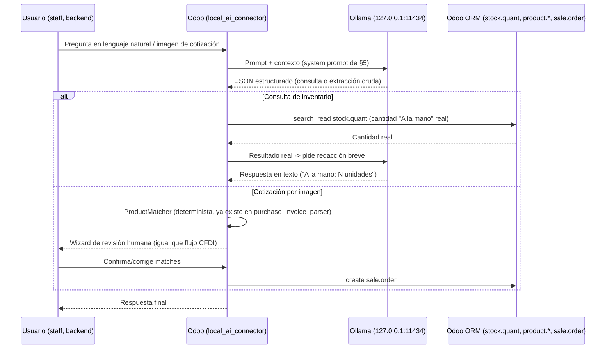

# Configuración del Modelo de IA Local para Odoo 19 — MedicineDepot
# Local AI Model Configuration for Odoo 19 — MedicineDepot

**Fecha / Date:** 2026-07-27
**Autor / Author:** Claude Code (AI Infrastructure Architect / Odoo 19 Lead Developer)
**Basado en / Based on:** auditoría directa del servidor (`nproc`, `free -h`, `lspci`, `ollama list`, `systemctl status ollama`, `ss -tlnp`), del repositorio (`docker-compose.yml`, `docker-compose.test.yml`, `config/odoo*.conf`, `docs/OLLAMA_MIGRATION_PLAN.md`, `custom_addons/purchase_invoice_parser/`), y de las respuestas del usuario sobre casos de uso prioritarios. / direct audit of the server, the repository, and the user's answers on priority use cases — no fabricated data.

---

## 0. Nota metodológica / Methodological Note

Este documento no parte de cero: `docs/OLLAMA_MIGRATION_PLAN.md` ya estableció que Ollama (`qwen2.5-coder:7b`) opera en este servidor desde fuera de Odoo, para dos casos de uso (copiloto ETL y auditoría de compatibilidad de módulos), bajo una regla de gobernanza estricta (todo script generado por IA contra datos reales debe commitearse antes de ejecutarse) y una regla de terminología inquebrantable ('A la mano' / On Hand, nunca "Disponible"/"Stock"/"Existencias"). Este documento **extiende** esa base para cubrir los nuevos casos de uso que el usuario definió hoy: consultas de inventario en lenguaje natural, análisis de reportes financieros/anomalías, y un caso nuevo y más complejo — extracción de productos desde imágenes de cotizaciones escritas a mano.
This document doesn't start from zero: `docs/OLLAMA_MIGRATION_PLAN.md` already established Ollama's two current use cases (ETL copilot, module audit) under a strict governance rule and the unbreakable 'A la mano' (On Hand) terminology rule. This document **extends** that base to cover the new use cases the user defined today.

---

## 1. Resumen Ejecutivo / Executive Summary

| Dimensión | Estado |
|---|---|
| Hardware | 8 CPU (AMD EPYC-Milan, virtualizado), 15 GiB RAM (~9.8 GiB disponibles en promedio), **sin GPU** — inferencia 100% CPU. |
| Ollama | `0.32.4`, `systemd` activo, solo escucha en `127.0.0.1:11434` (sin exposición externa). |
| Modelo instalado | `qwen2.5-coder:7b` (4.7 GB, ~9.7 tok/s en CPU, medido). Texto/código únicamente — **no es multimodal**. |
| Contención del host | `dev` (workers=5, ~2.5GB límite) + `test` (workers=2, ~1.5GB límite) ya comparten el mismo host de 8 CPU/15GB. Ollama es el tercer consumidor. |
| Uso actual | Externo a Odoo: copiloto ETL (scripts xmlrpc.client) + auditoría de compatibilidad de módulos (`.migration-context.json`). |
| Casos de uso nuevos definidos hoy | (1) Consultas de inventario en lenguaje natural ('A la mano'), (2) análisis de reportes financieros/detección de anomalías, (3) extracción de productos desde imágenes de cotizaciones escritas a mano. |
| Brecha detectada | El caso (3) requiere capacidad de **visión**, que el modelo actual no tiene. No hay OCR (`tesseract`) ni librerías de visión (`pytesseract`, `PIL`, `cv2`) instaladas en el servidor. |
| Precedente reutilizable | `custom_addons/purchase_invoice_parser/services/product_matcher.py` ya resuelve "texto extraído → producto real de Odoo" (por barcode/código/nombre) para facturas CFDI. El mismo patrón sirve para (1) y (3). |

---

## 2. Infraestructura Auditada / Audited Infrastructure

### 2.1 Hardware
- CPU: 8 núcleos, AMD EPYC-Milan virtualizado.
- RAM: 15 GiB totales, ~9.8 GiB disponibles en promedio (picos de cgroup de Ollama ya observados hasta 7.9 GB).
- GPU: ninguna. `nvidia-smi` no existe; `lspci` solo muestra un dispositivo de video virtual sin capacidad de cómputo.
- Disco: 438 GB libres de 464 GB — sin restricción para modelos adicionales.

### 2.2 Contención de recursos entre servicios
```
Host: 8 CPU / 15 GiB RAM
├── dev  (8069): workers=5, límite memoria ~2.5GB
├── test (8070): workers=2, límite memoria ~1.5GB
└── Ollama (11434): sin límite de cgroup explícito hoy, picos observados de ~7.9GB
```
**Implicación de diseño:** no hay margen para correr un modelo pesado de forma permanente residente en memoria además de `dev`+`test`. Cualquier modelo nuevo (ej. visión) debe evaluarse primero en modo prueba de concepto, con `OLLAMA_KEEP_ALIVE` bajo (descargar el modelo de RAM entre usos) en vez de mantenerlo cargado 24/7.

### 2.3 Seguridad de red (ya correcto, mantener así)
Ollama solo escucha en `127.0.0.1:11434`. **Ningún endpoint nuevo debe exponer Ollama directamente a internet ni a la red del contenedor de Odoo sin pasar por el proceso de Odoo mismo** — Odoo (backend) debe ser el único cliente de Ollama, nunca el navegador del usuario final.

---

## 3. Modelos Recomendados / Recommended Models

### 3.1 Texto/código (ya instalado, mantener)
`qwen2.5-coder:7b` — sigue siendo correcto para: copiloto ETL, auditoría de módulos, consultas de inventario en lenguaje natural (texto→texto, sin imágenes), y análisis de reportes financieros (el input son tablas/JSON, no imágenes).

### 3.2 Visión (NUEVO — requerido para el caso de "cotización por imagen")
No hay modelo de visión instalado. Opciones evaluadas para hardware **CPU-only, 8 núcleos, RAM compartida**:

| Modelo | Tamaño | Trade-off |
|---|---|---|
| `moondream:1.8b` | ~1.7 GB | **Probado empíricamente (2026-07-27) — falló.** Ver resultado del PoC abajo. Descartado. |
| `qwen2.5vl:7b` | ~6 GB | **Probado empíricamente (2026-07-27) — funcionó, con reservas de latencia y RAM.** Ver resultado del PoC abajo. Candidato viable, pendiente de validar con letra manuscrita real. |
| `llava:7b` | ~4.7 GB | No probado. Alternativa intermedia, comunidad más madura, pero orientado a descripción general de escenas, no especializado en lectura de texto/handwriting. |

**Resultado real del PoC con `moondream:1.8b` (2026-07-27):** se bajó el modelo (1.7GB, ~10s), se generó una imagen sintética con 3 nombres de producto en **texto impreso simple** (no manuscrito — el caso más fácil posible: "PARACETAMOL 500MG C/20 TAB x2", "LOSARTAN 50MG C/30 TABS x1", "IBUPROFENO 400MG C/10 CAP x3"), y se corrió contra el prompt de §5.3 (`format:"json"`, `temperature:0`). **Resultado: falló por completo.** El modelo devolvió `{"texto_detectado": "A la mano", "cantidad_detectada": 0}` — no leyó ningún nombre de producto, y aparentemente alucinó una frase del propio system prompt en vez de transcribir la imagen. Tiempo: 10.29s. Pico de RAM del subproceso de inferencia: ~2.24 GB.

**Resultado real del PoC con `qwen2.5vl:7b` (2026-07-27):** mismo prompt (§5.3), misma imagen sintética, `temperature:0`, `num_ctx:2048`. **Resultado: acertó las 3 líneas de texto impreso correctamente**, incluyendo el encabezado "COTIZACION":
```json
{
  "texto_detectado": "COTIZACION\nPARACETAMOL 500MG C/20 TAB x2\nLOSARTAN 50MG C/30 TABS x1\nIBUPROFENO 400MG C/10 CAP x3",
  "cantidad_detectada": ["x2", "x1", "x3"]
}
```
Dos reservas importantes, no es un "sí" sin matices:
1. **Latencia: 76.45s** para una imagen de 3 líneas cortas (7.6s de carga del modelo + ~69s de evaluación, 85 tokens de salida) — en CPU puro, esto es demasiado lento para un flujo "interactivo" (un usuario esperando en pantalla). Es viable como proceso asíncrono/background (el staff sube la imagen y recibe la propuesta unos minutos después), no como respuesta instantánea.
2. **RAM pico: 6.72 GB** (`VmHWM` del subproceso `llama-server`) — confirmado con `ollama ps` mientras el modelo seguía cargado. Sumado a los límites configurados de `dev` (~2.5GB) y `test` (~1.5GB), el host de 15GB queda **sin margen** si los tres corren a la vez. Esto hace más urgente la pregunta abierta §9.3 (presupuesto de RAM dedicado).
3. **El formato de salida no respetó el schema pedido** (`cantidad_detectada` debía ser una lista de objetos por línea, no un objeto único con un arreglo de strings "x2"/"x1"/"x3") — el prompt de §5.3 necesita ajuste para forzar una lista de objetos `{"texto_detectado", "cantidad_detectada"}` por renglón, no un batch combinado. Detalle de implementación, no invalida el resultado de lectura.

**Conclusión actualizada:** `qwen2.5vl:7b` es el candidato viable para este caso de uso — es el primer modelo que realmente lee el texto de la imagen. Sigue pendiente la prueba con **letra manuscrita real** de clientes (la sintética era texto impreso, el caso fácil) antes de comprometerse en producción, y hay que decidir si el flujo se diseña como asíncrono (dado el tiempo de respuesta) desde el principio.

**Recomendación actualizada:** descartar `moondream:1.8b` para este caso de uso — no superó ni el escenario más fácil (texto impreso). El siguiente paso empírico es repetir la misma prueba con `qwen2.5vl:7b` (más pesado, ~6GB, pero mismo linaje que el modelo de texto que ya funciona bien en este proyecto). Si `qwen2.5vl:7b` tampoco logra leer texto impreso simple, el problema no es de tamaño de modelo sino de que la tarea (vision LLM corriendo en CPU puro) no es viable con el hardware actual, y habría que evaluar un enfoque no-LLM (OCR clásico tipo Tesseract, que no se probó aquí) como paso intermedio antes del matching de productos. Con un solo intento fallido (N=1, texto impreso) no se puede descartar la familia de solución completa — pero sí se puede descartar `moondream:1.8b` específicamente como candidato viable.

---

## 4. Model Tuning — Parámetros por Caso de Uso

| Caso de uso | `num_ctx` | `temperature` | `format` | Justificación |
|---|---|---|---|---|
| ETL / copiloto de scripts (ya en uso) | 4096 | 0.1 | texto (código) | Determinismo alto; ya se detectó que el modelo comete errores de lógica ORM — temperatura baja reduce (no elimina) variabilidad. |
| Auditoría de compatibilidad de módulos (ya en uso) | 4096 | 0.1 | `json` | Igual que hoy — output estructurado y parseable. |
| Consultas de inventario en lenguaje natural ('A la mano') | 2048 | 0.0–0.1 | `json` | Pregunta corta + resultado de una consulta real a Odoo (no el modelo "inventando" cantidades) — el modelo solo traduce lenguaje natural a una consulta estructurada y luego redacta la respuesta con el dato real. Temperatura casi cero: es la peor categoría posible para alucinar (cantidades físicas / dinero). |
| Análisis de reportes financieros / detección de anomalías | 8192 | 0.2 | `json` para hallazgos, texto libre para el resumen | Puede requerir tablas más largas (ej. cientos de líneas de productos, como el caso de las caídas de precio del 27/07). Temperatura ligeramente más alta para permitir redacción de resumen, pero los hallazgos estructurados (qué producto, qué cambio, qué %) deben ir en JSON separado del resumen narrativo, nunca mezclados. |
| Extracción de productos desde imagen (visión) | según modelo (2048–4096) | 0.0 | `json` | Cero tolerancia a redacción libre: el output debe ser una lista JSON de `{texto_detectado, cantidad_detectada}` cruda, sin que el modelo intente adivinar cuál producto de Odoo es — ese matching lo hace `ProductMatcher` (determinista), no el LLM. |

**Regla transversal:** en ningún prompt de estos el modelo debe **inventar** una cantidad física ('A la mano') o un precio — solo puede (a) traducir lenguaje natural a una consulta estructurada que Odoo ejecuta con datos reales, o (b) redactar/resumir un resultado que Odoo ya calculó. El LLM nunca es la fuente de verdad de un número de inventario o dinero.

---

## 5. System Prompts Base

### 5.1 Prompt — Consultas de inventario en lenguaje natural ('A la mano')
```
Eres un asistente de inventario para MedicineDepot, una farmacia que opera sobre Odoo 19.

REGLA INQUEBRANTABLE: el único término permitido para referirte a la cantidad física
de un producto es "A la mano" (On Hand). Nunca uses "disponible", "stock" o "existencias",
ni en español ni en inglés, bajo ninguna circunstancia.

No conoces cantidades reales. Tu única función es:
1. Traducir la pregunta del usuario a una consulta estructurada en JSON:
   {"producto": "<nombre o código mencionado>", "campo": "a_la_mano"}
2. Cuando el sistema te devuelva el resultado real (consultado en stock.quant),
   redactar una respuesta breve usando exclusivamente el término "A la mano".

Si la pregunta no se refiere a un producto identificable, responde pidiendo aclaración
en vez de adivinar.
```

### 5.2 Prompt — Análisis de reportes financieros / anomalías
```
Eres un analista de datos para MedicineDepot sobre Odoo 19. Recibirás una tabla de
productos con precios anterior y nuevo (list_price y/o standard_price).

Tu tarea es identificar anomalías: cambios porcentuales extremos (ej. caídas o subidas
mayores al 80%) que probablemente sean errores de datos en vez de correcciones legítimas.

Si el análisis involucra cantidades físicas de producto, usa exclusivamente el término
"A la mano" (On Hand) — nunca "disponible", "stock" o "existencias".

Responde en JSON: [{"producto_id": ..., "nombre": ..., "cambio_pct": ..., "riesgo": "alto|medio|bajo"}]
No expliques cada fila en prosa — el resumen narrativo va aparte, en un campo "resumen" al final.
```

### 5.3 Prompt — Extracción de productos desde imagen de cotización
```
Vas a recibir una imagen con una lista de productos escrita o impresa por un cliente
de una farmacia, para generar una cotización.

Tu única tarea es transcribir lo que ves, SIN intentar adivinar a qué producto exacto
del catálogo se refiere y SIN inventar cantidades. Devuelve exclusivamente JSON:

[{"texto_detectado": "<tal cual aparece en la imagen>", "cantidad_detectada": <numero o null>}]

Si algún renglón menciona una cantidad física de inventario existente (poco común en
este flujo, pero si ocurre), refiérete a ella únicamente como "A la mano" (On Hand).
Nunca uses "disponible", "stock" o "existencias".

Si no puedes leer un renglón con confianza, inclúyelo igual con "texto_detectado" tal
cual lo percibes y un campo adicional "confianza_baja": true — no lo omitas ni lo
completes con una suposición.
```

### 5.4 Prompts ya formalizados en `docs/OLLAMA_MIGRATION_PLAN.md` §4/§11 (sin cambios)
- Generación de scripts ETL (`xmlrpc.client`) — reutilizar tal cual, ya incluye la regla 'A la mano'.
- Auditoría de compatibilidad de módulos (`audit_phase_1`) — reutilizar tal cual.

---

## 6. Integration Flow / Arquitectura de Integración

### 6.1 Decisión: arquitectura híbrida, no todo-o-nada

| Caso de uso | Mecanismo | Por qué |
|---|---|---|
| ETL / auditoría de módulos | Scripts externos `xmlrpc.client` (ya en uso) | Son operaciones batch, offline, con revisión humana obligatoria antes de commitear/ejecutar — no necesitan estar "en vivo" dentro de Odoo. |
| Consultas de inventario en lenguaje natural | **Módulo nuevo `local_ai_connector`**, endpoint interno | Necesita ser interactivo (usuario pregunta, espera respuesta en segundos) — no tiene sentido como script externo. |
| Análisis de reportes financieros | `local_ai_connector`, invocado desde un botón/wizard en el backend, o cron programado para reportes periódicos | Puede ser interactivo (bajo demanda) o programado (ej. reporte semanal de anomalías). |
| Extracción de cotización por imagen | `local_ai_connector` + reutilización de `ProductMatcher` (de `purchase_invoice_parser`) + wizard de revisión humana | Mismo patrón ya probado en producción para CFDI: extracción automática → matching determinista → revisión humana → creación del documento final (`sale.order` en este caso). |

### 6.2 Por qué un módulo Odoo y no exponer Ollama directamente
- Ollama ya está correctamente aislado en `127.0.0.1:11434` — debe seguir así. El navegador del cliente/usuario **nunca** debe hablarle a Ollama directamente.
- El repo ya tiene una convención establecida de controladores (`type='jsonrpc'`/`type='json'`, `auth='public'` o `auth='user'` según el caso) en `custom_shop_qty_selector`, `md_cart_barcode_scanner`, `medicine_depot_website` — `local_ai_connector` sigue el mismo patrón, no inventa uno nuevo.
- Regla de seguridad ya escrita en el repo (`medicine_depot_portal`): nunca `csrf=False` salvo webhooks externos, siempre con autenticación de origen. Los endpoints de `local_ai_connector` para consultas internas usan `auth='user'` (staff autenticado) — **no son públicos** en esta primera fase, incluyendo el de cotización por imagen (ver §8, decisión pendiente de confirmar).

### 6.3 Diagrama de flujo / Flow diagram



---

## 7. Estructura Propuesta del Módulo `local_ai_connector`

```
custom_addons/local_ai_connector/
├── __manifest__.py                 # depends: base, stock, sale, purchase_invoice_parser (reutiliza ProductMatcher)
├── controllers/
│   └── ai_api.py                   # /ai/inventory_query (auth='user'), /ai/quote_from_image (auth='user')
├── services/
│   ├── ollama_client.py            # wrapper HTTP a 127.0.0.1:11434, timeouts, manejo de errores
│   ├── prompt_templates.py         # las plantillas de §5 como constantes versionadas
│   └── inventory_nl_resolver.py    # traduce el JSON del modelo -> domain de stock.quant real
├── wizards/
│   └── image_quote_review_wizard.py   # mismo patrón de revisión que purchase_invoice_import_wizard
├── models/
│   └── ai_query_log.py             # auditoría: qué se preguntó, qué prompt/versión, qué respondió Odoo (no solo el modelo)
├── security/
│   └── ir.model.access.csv
└── tests/
    └── test_inventory_nl_resolver.py   # sin llamar a Ollama real en CI -- mockear la respuesta del modelo
```

**Nota de gobernanza:** igual que con los scripts ETL, cada versión de `prompt_templates.py` debe commitearse antes de usarse contra datos reales, y `ai_query_log` deja rastro de cada interacción — mismo principio de auditabilidad que ya rige el resto del proyecto (evitar el problema de los 33,725 registros `POS-*` sin script versionado).

---

## 8. Gobernanza de Recursos / Resource Governance

- **No cargar el modelo de visión de forma permanente.** Usar `OLLAMA_KEEP_ALIVE=60s` (o similar) para que Ollama libere RAM entre solicitudes, dado que el host ya está al límite con `dev`+`test`.
- **Cola de una sola solicitud a la vez.** Con CPU compartido, procesar solicitudes de IA en serie (un lock simple en `ollama_client.py`) para no degradar la respuesta de `dev`/`test` durante un pico de uso.
- **Ningún caso de uso nuevo debe correr en el mismo momento que una migración de módulo o un test suite completo** — coordinar manualmente hasta que haya métricas reales de contención.

---

## 9. Preguntas Abiertas / Open Questions

1. **¿El flujo de cotización por imagen es solo para staff interno, o también para clientes finales vía portal público?** Este documento asume **staff interno** (`auth='user'`, mismo patrón que `purchase_invoice_parser`) como punto de partida seguro. Si se decide exponerlo a clientes finales, se necesita re-diseñar con las mismas protecciones que ya se aplicaron a `/afiliacion` (rate limiting, validación de archivos, límites de tamaño) — no asumir que un endpoint público hacia un LLM es seguro por defecto.
   - **Contexto factual encontrado (2026-07-27, no decide la pregunta, solo la informa):** el repo ya tiene precedente de ambos patrones conviviendo. Endpoints **públicos** que ya reciben adjuntos de clientes sin login, con protecciones concretas: `/web/afiliacion/submit` y `/web/medicd/submit` (`medicine_depot_website/controllers/api.py`, límite 6MB/archivo, whitelist de mimetypes PDF/JPEG/PNG, `csrf=False` justificado), y `/afiliacion` (rate limiting real vía modelo Postgres). Endpoints **autenticados** también existen (`scan_barcode_add_to_cart`, portal `/my`). No hay integración de WhatsApp API — solo enlaces "click-to-chat" (`wa.me/...`). Si el negocio ya recibe estas cotizaciones por WhatsApp hoy (fuera de Odoo), ese es un dato relevante para decidir el canal de entrada que el usuario debe aportar.
2. **Precisión real de OCR de escritura a mano en productos farmacéuticos** — **2 PoC ejecutados (2026-07-27):** `moondream:1.8b` falló por completo (alucinó en vez de transcribir); `qwen2.5vl:7b` **sí leyó correctamente** las 3 líneas de texto impreso sintético, pero en 76.45s y con 6.72GB de RAM pico (detalle completo en §3.2). Se descarta `moondream:1.8b`; `qwen2.5vl:7b` queda como candidato viable pero **todavía sin validar con letra manuscrita real** (la prueba fue con texto impreso, el caso fácil) — sigue pendiente conseguir imágenes reales de cotizaciones del negocio para la prueba definitiva. También queda pendiente decidir si el flujo se diseña asíncrono desde el inicio, dada la latencia de ~76s por imagen en este hardware.
3. **¿Hay presupuesto de RAM/CPU dedicado para IA, o sigue compartiendo host con `dev`/`test` indefinidamente?** Afecta directamente si vale la pena escalar a `qwen2.5vl:7b` — con el fallo de `moondream:1.8b`, este punto se vuelve más urgente: la única alternativa de visión evaluada hasta ahora que queda en pie (`qwen2.5vl:7b`) es también la más pesada en RAM.
