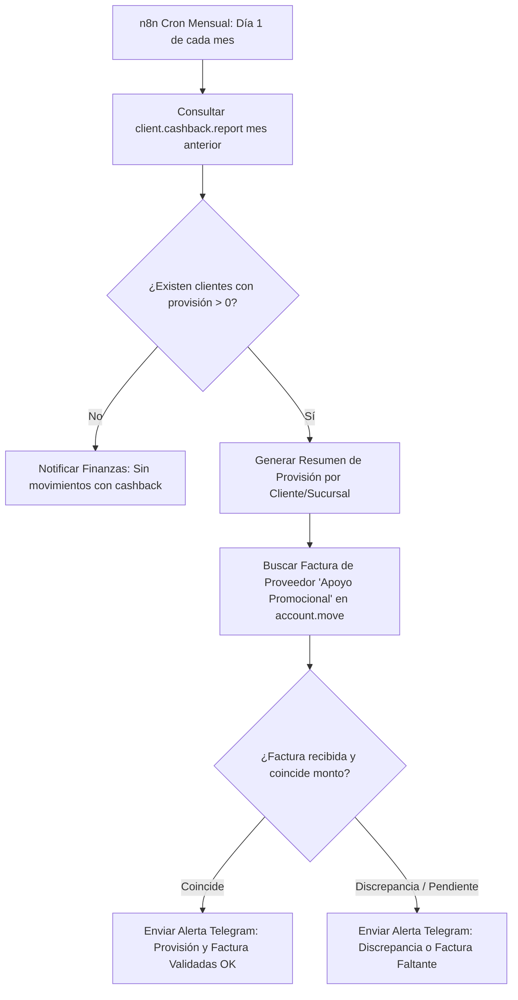

# Auditoría Técnica — Módulo `md_cashback_report` (Odoo 19)

**Fecha de auditoría:** 13 de agosto de 2026  
**Entorno auditado:** Servidor Ionos (`medicinedepot-odoo19-migration`, BD: `medicinedepot_dev`)  
**Módulo:** `md_cashback_report` (`custom_addons/md_cashback_report`)  
**Autor del módulo:** Medicine Depot, Daniel Cervera  
**Versión:** `19.0.1.0.0`  

---

## 1. Resumen Ejecutivo

| Aspecto | Estado / Detalle |
|---|---|
| **Estado en Odoo** | `installed` en base de datos `medicinedepot_dev` |
| **Tipo de Módulo** | Reporte dinámico no persistente (`_auto = False`, SQL View PostgreSQL) |
| **Objetivo de Negocio** | Trazabilidad del esquema de descuento global del 7% dividido en:<br>• **2%** descuento comercial aplicado por línea en factura.<br>• **5%** provisión acumulada de devolución en efectivo (*cashback*) a fin de mes. |
| **Alcance Operativo** | **Prospectivo**: Filtra facturas posteadas (`posted`) donde ya se capturó `discount > 0` en clientes con el flag `x_cashback_split_scheme = True`. |
| **Preparación para RPA (n8n)** | Alta compatibilidad vía XML-RPC (`client.cashback.report`) o conexión directa a PostgreSQL (`public.client_cashback_report`). |

---

## 2. Arquitectura del Módulo

### 2.1. Estructura de Archivos
```text
custom_addons/md_cashback_report/
├── __init__.py
├── __manifest__.py
├── models/
│   ├── __init__.py
│   ├── res_partner.py              # Extensión de res.partner con flag de activación
│   └── client_cashback_report.py    # Definición del modelo y vista SQL de agregación
├── security/
│   └── ir.model.access.csv         # Permisos de solo lectura para contabilidad y facturación
└── views/
    ├── res_partner_views.xml        # Campo en formulario de contactos
    └── client_cashback_report_views.xml # Vistas Lista, Pivot, Gráfico, Búsqueda y Menú
```

### 2.2. Modelos Afectados y Campos

#### A. Modelo `res.partner` (Extensión)
- **Campo añadido:** `x_cashback_split_scheme` (`fields.Boolean`)
- **Etiqueta:** *Esquema descuento 2% + cashback 5%*
- **Ubicación en UI:** Insertado en la vista formulario (`base.view_partner_form`) después de `category_id`.
- **Función:** Marca a los clientes elegibles para ingresar en la agregación del reporte.

#### B. Modelo `client.cashback.report` (Nuevo, SQL View)
- **Modelo:** `client.cashback.report` (`_auto = False`)
- **Orden por defecto:** `invoice_month desc, company_id, partner_id`
- **Campos:**
  - `partner_id` (`Many2one` a `res.partner`): Cliente asociado.
  - `company_id` (`Many2one` a `res.company`): Sucursal / Compañía emisora.
  - `invoice_month` (`Date`): Primer día del mes de facturación (`DATE_TRUNC('month', invoice_date)`).
  - `currency_id` (`Many2one` a `res.currency`): Moneda de la transacción.
  - `invoice_count` (`Integer`): Cantidad de facturas distintas en el periodo.
  - `base_amount` (`Monetary`): Suma de `price_unit * quantity` antes de descuento.
  - `discount_amount` (`Monetary`): Suma de `price_unit * quantity * (discount / 100.0)`.
  - `invoiced_total` (`Monetary`): Suma de `price_total` (con descuento e impuestos).
  - `cashback_provision` (`Monetary`): Cálculo teórico del 5% (`base_amount * 0.05`).

### 2.3. Vistas y UI (Odoo 19)
- Cumple con la convención de Odoo 19 utilizando `<list>` (en lugar del obsoleto `<tree>`).
- Vistas implementadas:
  - **Lista (`list`):** Con agregaciones `sum` en pie de tabla para totales.
  - **Pivot (`pivot`):** Configurada por defecto agrupando en filas por `(Cliente, Sucursal)` y columnas por `Mes (interval="month")`.
  - **Gráfico (`graph`):** Tipo barra apilada por mes y sucursal.
  - **Búsqueda (`search`):** Filtros rápidos y agrupadores por Cliente, Sucursal y Mes.
- **Acceso:** Menú contable en *Contabilidad > Reportes > Trazabilidad Cashback 2%+5%* (`account.menu_finance_reports`, secuencia 150).

---

## 3. Lógica de Negocio y Cálculo Contable

### 3.1. Definición de la Vista SQL
```sql
CREATE OR REPLACE VIEW client_cashback_report AS (
    SELECT
        ROW_NUMBER() OVER (
            ORDER BY am.partner_id, am.company_id, DATE_TRUNC('month', am.invoice_date)
        )::integer                                         AS id,
        am.partner_id                                      AS partner_id,
        am.company_id                                      AS company_id,
        DATE_TRUNC('month', am.invoice_date)::date         AS invoice_month,
        am.currency_id                                     AS currency_id,
        COUNT(DISTINCT am.id)                              AS invoice_count,
        SUM(aml.price_unit * aml.quantity)                 AS base_amount,
        SUM(aml.price_unit * aml.quantity * aml.discount / 100.0)
                                                            AS discount_amount,
        SUM(aml.price_total)                               AS invoiced_total,
        SUM(aml.price_unit * aml.quantity) * 0.05          AS cashback_provision
    FROM account_move_line aml
    JOIN account_move am ON am.id = aml.move_id
    JOIN res_partner rp ON rp.id = am.partner_id
    WHERE am.move_type = 'out_invoice'
      AND am.state = 'posted'
      AND aml.display_type = 'product'
      AND aml.discount > 0
      AND rp.x_cashback_split_scheme = TRUE
    GROUP BY
        am.partner_id, am.company_id,
        DATE_TRUNC('month', am.invoice_date), am.currency_id
);
```

### 3.2. Mecánica del Esquema 7% (2% + 5%)
1. **Descuento en Factura (2%):**
   - Se captura en la línea de la factura (`account.move.line.discount = 2.0`).
   - Reduce directamente el precio unitario neto y la base gravable de impuestos al emitir el CFDI.
   - Queda reflejado en `discount_amount`.
2. **Provisión de Devolución / Cashback (5%):**
   - No aparece reflejado en la factura de venta para evitar distorsiones fiscales en el CFDI de venta.
   - Se calcula teóricamente como el `5%` de la base bruta (`price_unit * quantity`).
   - La suma del 2% en factura + 5% provisionado equivale al 7% del monto base bruto del cliente.

### 3.3. Hallazgos Técnicos y Casos Borde Identificados
1. **Notas de Crédito y Devoluciones (`out_refund`):**
   - La cláusula actual filtra exclusivamente `am.move_type = 'out_invoice'`.
   - *Implicación:* Si un cliente con cashback devuelve producto o recibe una nota de crédito, la provisión del 5% del mes **no se reduce automáticamente**. Si se requiere ajustar por devoluciones, se deberá contemplar en una fase posterior considerar `out_refund` restando montos.
2. **Líneas con descuentos distintos al 2%:**
   - La vista valida `aml.discount > 0`. Si un operador captura por error un 5% o 10% de descuento en la línea, la vista calculará `discount_amount` con ese porcentaje, pero la provisión de cashback seguirá calculándose como el 5% de la base.
3. **Naturaleza de la Provisión vs Liquidación Real:**
   - En la operativa real de Medicine Depot, el 5% se liquida mensualmente mediante una **factura de proveedor** que emite el cliente bajo el concepto de *"Apoyo promocional y de asesoría por exclusividad"* (cuenta de Propaganda y Publicidad).
   - El módulo actual genera la **cifra teórica de provisión** para que finanzas valide la factura de gastos antes de pagarla.

---

## 4. Estado Actual en el Servidor Ionos

1. **Estado del Módulo:** Instalado y funcional en `medicinedepot_dev`.
2. **Clientes Configurados:**
   - Se identificó a `FARMACIAS ECONOMICAS DE OCCIDENTE SA DE C.V.` (`id: 4976`) con `x_cashback_split_scheme = True`.
3. **Registros Históricos:**
   - El histórico existente de facturas tiene `discount = 0.00`, por lo que la vista retorna `0` filas actualmente. Esto es consistente con la naturaleza **prospectiva** del diseño (comenzará a poblarse en cuanto se emitan facturas con descuento capturado).

---

## 5. Puntos de Conexión y Estrategia de Integración RPA con n8n

Para orquestar procesos automatizados a fin de mes, n8n dispone de los siguientes puntos de integración:

### 5.1. Conexión vía XML-RPC / JSON-RPC (Recomendado)
- **Modelo:** `client.cashback.report`
- **Operación n8n:** Nodo *Odoo* o nodo *HTTP Request / XML-RPC*.
- **Método:** `search_read`
- **Dominio de búsqueda:**
  ```python
  [
      ('invoice_month', '>=', '2026-08-01'),
      ('invoice_month', '<=', '2026-08-31')
  ]
  ```
- **Campos a consultar:**
  `['partner_id', 'company_id', 'invoice_month', 'invoice_count', 'base_amount', 'discount_amount', 'invoiced_total', 'cashback_provision', 'currency_id']`

### 5.2. Conexión Directa a PostgreSQL (Alternativa de Alto Rendimiento)
- **Tabla/Vista:** `public.client_cashback_report`
- **Consulta sugerida para n8n:**
  ```sql
  SELECT 
      c.id,
      p.name AS partner_name,
      comp.name AS company_name,
      c.invoice_month,
      c.invoice_count,
      c.base_amount,
      c.discount_amount,
      c.invoiced_total,
      c.cashback_provision
  FROM client_cashback_report c
  JOIN res_partner p ON p.id = c.partner_id
  JOIN res_company comp ON comp.id = c.company_id
  WHERE c.invoice_month = DATE_TRUNC('month', CURRENT_DATE - INTERVAL '1 month')::date;
  ```

### 5.3. Flujos RPA Diseñados para n8n



1. **Flujo 1: Digest Mensual de Provisión Cashback (Telegram / Email):**
   - **Disparador:** Cron el día 1 de cada mes a las 08:00 AM.
   - **Acción:** Extrae las provisiones acumuladas del mes cerrado y envía una tabla formateada a Telegram/Email al equipo de finanzas.
2. **Flujo 2: Auditoría de Inconsistencias de Captura:**
   - **Disparador:** Cron semanal.
   - **Acción:** Busca facturas posteadas de clientes con `x_cashback_split_scheme = True` que tengan `discount == 0` o `discount != 2%` para alertar errores de captura antes del cierre de mes.
3. **Flujo 3: Conciliación Automatizada de Factura de Gasto (Apoyo Promocional):**
   - **Disparador:** Webhook al registrarse una factura de proveedor (`in_invoice`) del cliente elegible.
   - **Acción:** Compara el subtotal facturado por el cliente en concepto de publicidad contra el campo `cashback_provision` del mes y reporta el margen de diferencia.

---

## 6. Estado y Próximos Pasos

- [x] Diagnóstico de modelos, vistas y consultas SQL completado vía SSH en Ionos.
- [x] Validación de la lógica de negocio (2% en factura + 5% fin de mes).
- [x] Documento técnico generado en `docs/auditoria_cashback_report.md`.
- [ ] **En espera de instrucciones:** No se ha realizado ninguna modificación al código fuente del módulo en el servidor.
