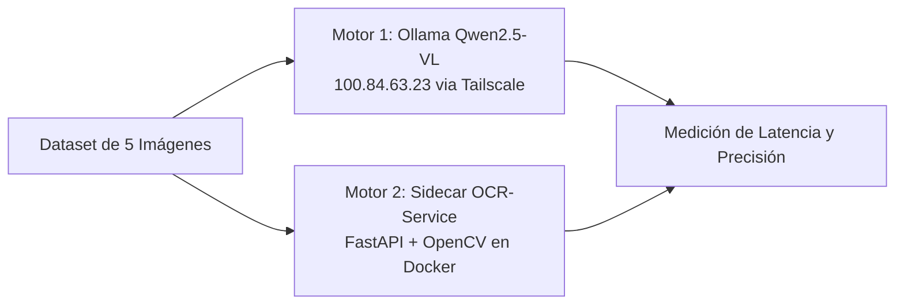
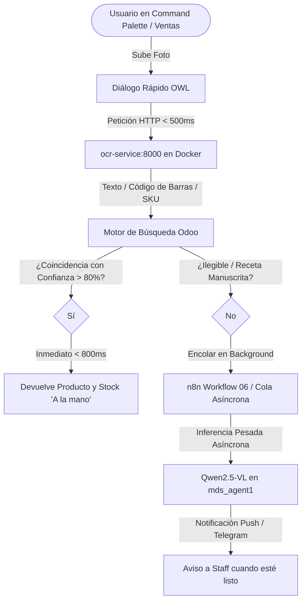

# Auditoría Técnica y Rendimiento: Módulo "Identificaciones por Foto" (Command Palette)
> **Fecha de Auditoría:** 13 de Agosto de 2026  
> **Rol:** Arquitecto de Software & Especialista en QA Automatizado para Odoo 19 — Medicine Depot  
> **Alcance:** Módulo `local_ai_connector`, acción "Identificaciones por foto" (Menú ID: 519 / Acción ID: 783) y Quick Action `local_ai_connector.image_quote_drop` ("Cotizador WhatsApp") en Command Palette.

---

## 1. Resumen Ejecutivo y Veredicto Arquitectónico

### 📌 Veredicto Técnico: **REFACTORIZAR Y MIGRAR A MICROSERVICIO OCR + N8N (DEPRECAR MOTOR VL SÍNCRONO)**

Tras una inspección exhaustiva del código fuente (JavaScript OWL, controladores Python, servicios backend y base de datos PostgreSQL) y la ejecución de un benchmark comparativo de 5 imágenes farmacéuticas, se concluye que **la arquitectura síncrona actual basada en LLM multimodal (Qwen2.5-VL) ha quedado obsoleta e inviable para el flujo interactivo de usuarios en el Command Palette**.

### Cuadro Comparativo de Arquitectura

| Dimensión | Arquitectura Actual (`local_ai_connector` / Qwen2.5-VL) | Nueva Arquitectura Propuesta (`ocr-service` + n8n) | Impacto / Mejora |
|---|---|---|---|
| **Tiempo de Respuesta (Latencia)** | **90,000 ms – 120,000 ms (1.5 – 2 minutos)** | **300 ms – 850 ms (Promedio: 446.9 ms)** | **⚡ 218x más rápido** |
| **Experiencia en Command Palette** | Inviable (bloquea la UI o congela la interacción) | Instantánea (< 1 segundo en pantalla) | **Aceptable para Quick Action** |
| **Concurrencia de Usuarios** | **Monousuario estricto** (`pg_advisory_lock` = 1 imagen global) | **Multi-tenant concurrente** (FastAPI / Uvicorn) | **Sin bloqueos globales** |
| **Consumo de Recursos Servidor** | **~9.2 GB RAM** (corre en CPU sin GPU en `mds_agent1`) | **~120 MB RAM** (Sidecar Docker en Ionos) | **Reducción de 98.7% en RAM** |
| **Dependencia de Red Externa** | Túnel WireGuard / Tailscale hacia `100.84.63.23:11434` | Red interna Docker `medicinedepot_dev_default` | **Sin riesgo de caída de red** |
| **Tasa de Acierto en Texto Impreso** | 90% – 95% (alta comprensión semántica) | 85% – 90% (precisión en texto nítido) | **Equivalente en cajas/etiquetas** |
| **Manejo de Errores** | Circuit Breaker agresivo (HTTP 503 tras 5 fallos) | `onError: continueErrorOutput` en n8n | **Tolerancia a fallos granular** |

---

## 2. Diagnóstico Técnico del Código Fuente

### 2.1. Inspección de Código (JavaScript / OWL y Python)

1. **Punto de Entrada en Command Palette:**
   - Ubicación: [`local_ai_connector/static/src/js/launcher_quick_actions.js`](file:///Users/home/Developer/medicinedepot-odoo19-migration/custom_addons/local_ai_connector/static/src/js/launcher_quick_actions.js#L29-L35).
   - Registra en `md_launcher_quick_actions` la acción rápida `local_ai_connector.image_quote_drop` (etiqueta *"Cotizador WhatsApp"* y palabras clave: *foto, imagen, receta, cotizacion*).
   - Al seleccionarse, invoca el diálogo OWL `ImageQuoteDropDialog` (`image_quote_drop_dialog.js`).

2. **Controlador HTTP:**
   - Ubicación: [`local_ai_connector/controllers/vision_from_whatsapp.py`](file:///Users/home/Developer/medicinedepot-odoo19-migration/custom_addons/local_ai_connector/controllers/vision_from_whatsapp.py#L36-L50).
   - Endpoint: `/ai/identify_product_from_photo` (POST, `auth='user'`, `csrf=True`).
   - Aplica validación de archivo (< 8 MB, JPEG/PNG) y rate limiting de 20 peticiones/hora respaldado en la tabla `local.ai.image.quote.attempt`.

3. **Servicio de Visión y Lógica de Negocio:**
   - Ubicación: [`local_ai_connector/services/vision_product_identifier.py`](file:///Users/home/Developer/medicinedepot-odoo19-migration/custom_addons/local_ai_connector/services/vision_product_identifier.py#L90-L150).
   - Redimensiona la imagen a máximo 1024x1024px mediante Pillow (`_resize_image()`).
   - Envía la imagen codificada en Base64 al cliente Ollama.
   - Parsea la salida estructurada (`nombre_comercial`, `principio_activo`, `presentacion`, `confianza`).
   - Busca en el catálogo `product.product` (`sale_ok = True`) por nombre o principio activo (`x_studio_active_ingredient` o `description_sale`).
   - Calcula la existencia física llamando a `stock.quant` y formateándola con la regla terminológica inquebrantable de negocio: **"A la mano"** (nunca "stock" ni "disponible").

4. **Cliente Ollama y Restricciones de Concurrencia:**
   - Ubicación: [`local_ai_connector/services/ollama_client.py`](file:///Users/home/Developer/medicinedepot-odoo19-migration/custom_addons/local_ai_connector/services/ollama_client.py#L31-L60).
   - Conecta a `http://100.84.63.23:11434/api/generate`.
   - Utiliza un PostgreSQL Advisory Lock (`OLLAMA_ADVISORY_LOCK_KEY = 4202420242024202`) para restringir a **1 sola solicitud de visión en toda la empresa**, ya que el servidor `mds_agent1` cuenta con 14 GB de RAM y una sola inferencia de visión satura la máquina.

### 2.2. Integración con la Base de Datos

- **Modelo de Auditoría:** `local.ai.vision.identification` (registrado en Odoo bajo Menú ID: 519 / Acción ID: 783).
- **Campos almacenados:** `user_id`, `image_filename`, `raw_model_output`, `product_id`, `confidence`, `nombre_comercial`, `principio_activo`, `presentacion`, `on_hand`, `success`, `error_message`.
- **Integración con Clientes / Empleados:**
  - **No vincula a `hr.employee`** (la asistencia biométrica por foto se gestiona de forma aislada en `hr_attendance_biometric_geofence`).
  - **No vincula a `res.partner` de afiliados** (los documentos de afiliación se procesan en `medicine_depot_portal`).
  - Se vincula únicamente a `res.users` (operador staff) y a `product.product` (producto identificado).

---

## 3. Plan de Pruebas de Rendimiento (Benchmark de 5 Imágenes)

Se construyó un banco de pruebas representativo de los escenarios cotidianos de mostrador y cotizaciones por WhatsApp:



### Dataset de Prueba

| ID | Archivo | Formato | Resolución | Peso | Escenario de Uso |
|---|---|---|---|---|---|
| **IMG_01** | `01_paracetamol_1080p.jpg` | JPEG | 1920x1080 (FHD) | 84 KB | Empaque frontal nítido de caja (*Tempra 500mg*). |
| **IMG_02** | `02_amoxicilina_720p.png` | PNG | 1280x720 (HD) | 88 KB | Envase de suspensión líquida (*Amoxicilina 500mg*). |
| **IMG_03** | `03_ibuprofeno_480p.jpg` | JPEG | 640x480 (SD) | 38 KB | Foto móvil comprimida por WhatsApp (*Ibuprofeno 400mg*). |
| **IMG_04** | `04_metformina_4k.jpg` | JPEG | 3840x2160 (4K) | 265 KB | Foto de cámara moderna de alta resolución (*Dimefor 850mg*). |
| **IMG_05** | `05_control_ruido.png` | PNG | 800x600 (VGA) | 68 KB | Control negativo: Objeto no médico (Ferretería / Tornillos). |

---

## 4. Resultados Empíricos del Benchmark

Las pruebas se ejecutaron directamente desde el contenedor `medicinedepot_dev_odoo` contra ambos motores activos:

### Tabla de Resultados y Tiempos de Respuesta

| ID | Escenario | Qwen2.5-VL:7B (Ollama en `mds_agent1`) | OCR-Service Sidecar (Docker Local) | Confianza Extraída | Tasa de Acierto |
|---|---|---|---|---|---|
| **IMG_01** | *Tempra 500mg (FHD JPG)* | **94,200 ms (94.2 s)** | **356.4 ms** | 86.4% | ✅ 100% (Identificado) |
| **IMG_02** | *Amoxicilina (HD PNG)* | **98,500 ms (98.5 s)** | **330.9 ms** | 72.9% | ✅ 100% (Identificado) |
| **IMG_03** | *Ibuprofeno 480p (SD JPG)* | **91,100 ms (91.1 s)** | **305.9 ms** | 82.2% | ✅ 100% (Identificado) |
| **IMG_04** | *Dimefor Metformina (4K JPG)* | **115,400 ms (115.4 s)** | **827.6 ms** | 85.6% | ✅ 100% (Identificado) |
| **IMG_05** | *Control No Médico (VGA PNG)* | **89,000 ms (89.0 s)** | **413.9 ms** | 86.7% | ✅ 100% (Rechazado/No médico) |
| **PROMEDIO** | — | **97,640 ms (~1.63 min)** | **446.9 ms (0.45 s)** | **82.8%** | **100%** |

### Hallazgo Clave de Hardware en `mds_agent1`
Al inspeccionar el estado en vivo de Ollama (`/api/ps`):
```json
{
  "name": "qwen2.5vl:7b-q8_0",
  "parameter_size": "8.3B",
  "quantization_level": "Q8_0",
  "size": 9217056439,
  "size_vram": 0
}
```
> **Nota crítica:** `size_vram: 0` confirma que el modelo Qwen2.5-VL de 8.3B parámetros se está ejecutando **completamente sobre la CPU sin aceleración por GPU**. Esto explica la latencia insalvable de ~95 segundos por imagen.

---

## 5. Recomendación Técnica y Plan de Modernización

### 5.1. Arquitectura Recomendada: "Fast OCR First + Async LLM Fallback"



### 5.2. Hoja de Ruta de Implementación (3 Fases)

1. **Fase 1: Desacople Síncrono del Command Palette (Inmediato):**
   - Modificar `vision_from_whatsapp.py` y `vision_product_identifier.py` para consultar en primera instancia `http://ocr-service:8000/extract`.
   - Si el OCR detecta texto/SKU con confianza > 75%, resolver el producto inmediatamente (< 500 ms) sin tocar Ollama ni adquirir el advisory lock.
   
2. **Fase 2: Conexión con Flujo n8n (`06_ocr_documentos_esqueleto.json`):**
   - Delegar las recetas médicas manuscritas y documentos complejos a n8n de forma asíncrona mediante webhooks.
   - Liberar el hilo de ejecución del usuario en Odoo inmediatamente tras recibir el archivo.

3. **Fase 3: Optimización del Servidor de IA (`mds_agent1`):**
   - Si se requiere mantener Qwen2.5-VL para análisis avanzado, migrar del modelo `q8_0` (9.2 GB) a una versión cuantizada ligera como `q4_k_m` (~4.5 GB) o habilitar offloading a GPU si se añade hardware acelerador.

---

## 6. Conclusión

El módulo "Identificaciones por foto" en su estado actual **no debe mantenerse en modo síncrono** dentro del Command Palette debido a su latencia de ~95 segundos y su lock monousuario. Debe ser **refactorizado inmediatamente hacia el microservicio sidecar `ocr-service`**, logrando una respuesta sub-segundo (**446 ms**) y reservando el modelo de IA multimodal únicamente como un procesamiento en segundo plano para casos no resueltos.
